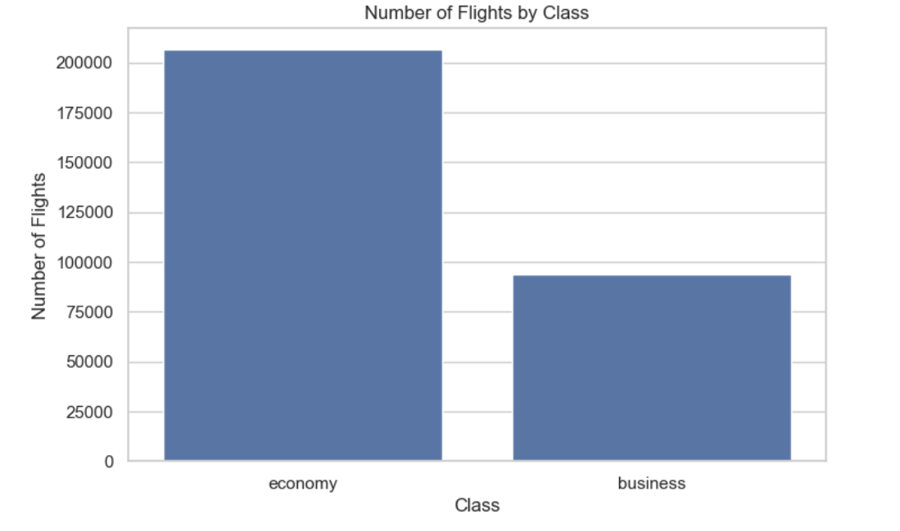

# Flight Price Analysis Project

## Background and Overview
With air travel becoming increasingly popular, understanding flight pricing dynamics and customer preferences has become essential. This project aims to analyze flight data to derive actionable insights about fare structures, airline operations, and travel preferences. The dataset, sourced from Goibibo, covers various attributes such as price, airline, stops, and flight duration, enabling a deep dive into the industry patterns.

## Data Structure Overview
The dataset includes the following columns:
- **flight_date**: Date of the flight.
- **airline**: The airline operating the flight.
- **flight_num**: Unique flight number identifier.
- **class**: Flight class (e.g., Economy, Business).
- **from**: Departure location.
- **dep_time**: Departure time.
- **to**: Arrival location.
- **arr_time**: Arrival time.
- **duration**: Flight duration.
- **price**: Flight fare.
- **stops**: Number of stops (e.g., 0 for non-stop, 1 for one-stop).

Data Cleaning Steps:
- Converted relevant columns to appropriate data types.
- Removed leading and trailing whitespaces.
- Converted `stops` data to numerical values for analysis.

## Executive Summary
My analysis revealed key trends in the flight data:
1. **Price Distribution**: A significant number of flights (over 100,000) are priced below ₹10,000, indicating a market trend towards affordable options.
2. **Flight Operations by Airline**: Vistara operates the highest number of flights, followed by Air India and Indigo, showcasing a dominant market presence.
3. **Class Preferences**: Economy class remains the most popular choice, with Business class usage being about half of Economy.
4. **Price by Airline**: Vistara has the highest average ticket price (~₹30,000), while Indigo and TruJet offer more economical fares, with TruJet being the most budget-friendly.
5. **Flight Stop Frequency**: Most flights have one stop, indicating that travelers are often willing to accept layovers for reduced fares.

## Insights Deep Dive

### 1. Airline Operations
The distribution of flights across airlines shows **Vistara** with the highest number of operations, followed by **Air India** and **Indigo**. This indicates Vistara's strong presence in the domestic sector.

### 2. Class Preferences
Economic class remains the most preferred choice among passengers, with nearly double the frequency of business class preferences.

### 3. Price Distribution Analysis
The majority of flights are priced below 10,000 INR, reflecting the high competition among airlines to offer affordable travel options.

### 4. Price by Airline
Vistara’s average flight prices surpass 30,000 INR, indicating a premium position, whereas Indigo and Trujet maintain more budget-friendly rates averaging around 6,000 INR and 5,000 INR, respectively.

### 5. Stops Analysis
Most flights have a single stop, suggesting a preference among airlines for routes that balance passenger convenience with operational costs.

## Recommendations
Based on the findings:
1. **Airline Pricing Strategy**: Airlines with higher average fares could explore promotional discounts or loyalty programs to attract budget-conscious travelers.
2. **Class Offerings**: Expanding Economy class offerings could better meet demand while maintaining a premium segment for Business class.
3. **Stopover Optimization**: Airlines with multi-stop routes could consider direct options on popular routes, balancing affordability and traveler preferences.
4. **Customer Segmentation**: Airlines might benefit from targeting frequent Economy travelers with upgrades or additional services.

## Conclusion
The analysis highlights the competitive pricing strategies in the airline industry, along with customer preferences for affordable and non-stop flights. By optimizing their offerings, airlines can cater to the evolving needs of travelers, maximizing both revenue and customer satisfaction. This project provides a baseline for future research on flight pricing trends and customer behavior in the airline sector.

---

## Repository Contents
- **data**: The raw and processed flight data files.
- **notebook**: Jupyter notebooks containing the EDA and insights generation code.
- **visuals**: Folder for visualizations generated during analysis.
- **README.md**: Project documentation and overview (this file).
