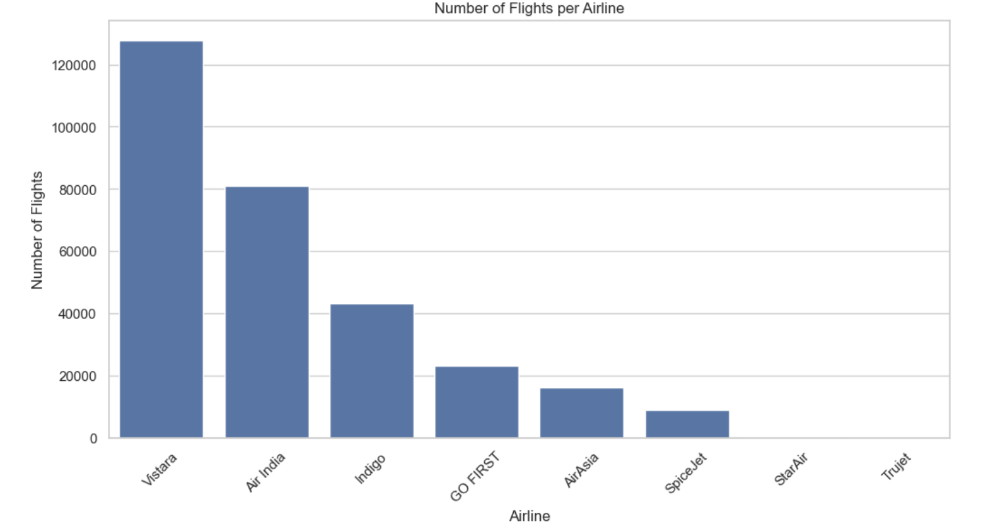
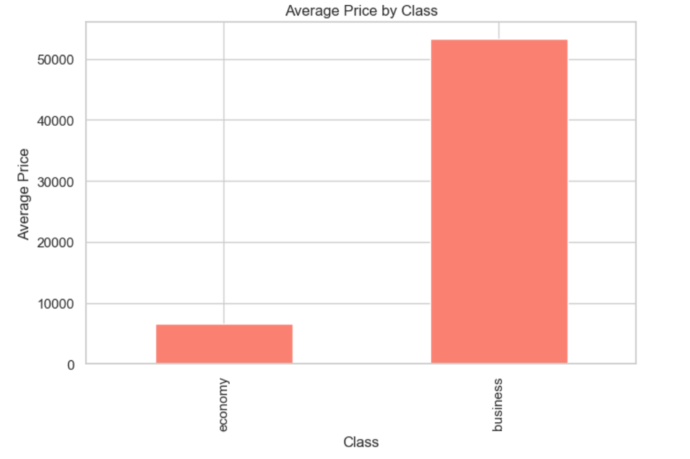
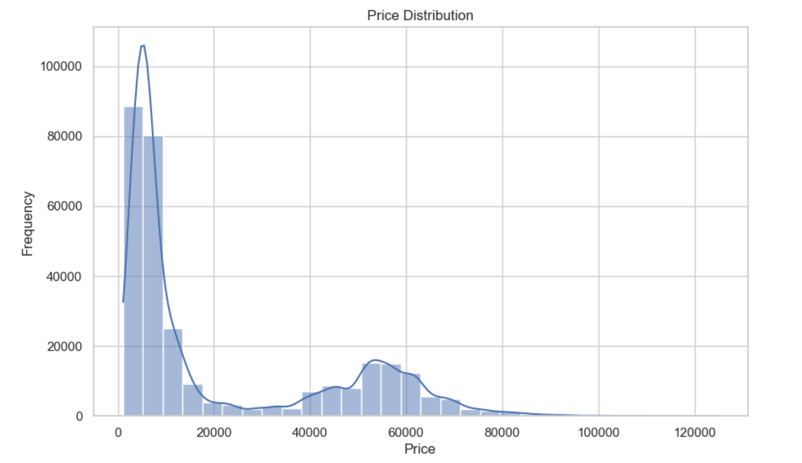
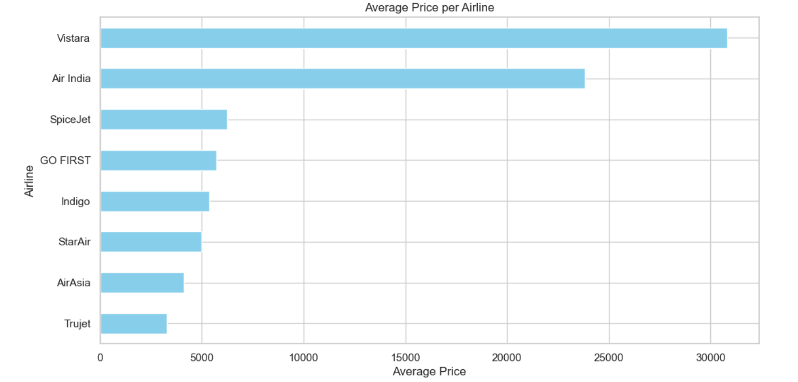
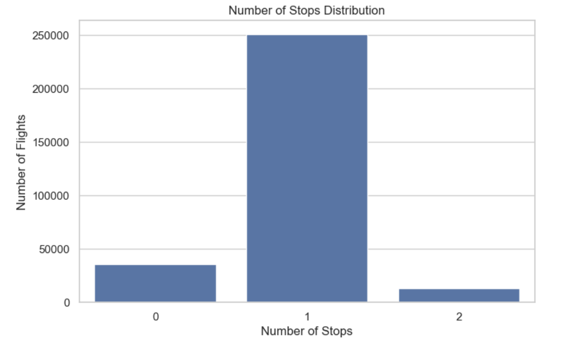

# Flight Price Analysis

## Background and Overview
This project provides a detailed analysis of flight data collected from various airlines, focusing on pricing trends, airline operations, and traveler preferences. The insights aim to assist both industry professionals and frequent flyers in understanding key factors influencing flight prices and operations.

## Data Structure Overview
The dataset consists of the following key features:
- **Flight Date**: Date of the flight.
- **Airline**: Airline operating the flight.
- **Flight Number**: Unique identifier for each flight.
- **Class**: Service class (Economy, Business).
- **Departure and Arrival Locations**: Source and destination airports.
- **Departure and Arrival Times**: Scheduled departure and arrival times.
- **Duration**: Total duration of the flight.
- **Price**: Ticket price for the flight.
- **Stops**: Number of stops (non-stop, 1 stop, 2 stops).

## Executive Summary
This exploratory data analysis reveals key insights into pricing dynamics, operational frequency, class preferences, and stopover trends among flights across various airlines. Through this analysis, we’ve identified both competitive advantages and pricing challenges faced by different airlines.

## Insights Deep Dive

### 1. Airline Operations
The distribution of flights across airlines shows **Vistara** with the highest number of operations, followed by **Air India** and **Indigo**. This indicates Vistara's strong presence in the domestic sector.

### 2. Class Preferences
Economic class remains the most preferred choice among passengers, with nearly double the frequency of business class preferences.

### 3. Price Distribution Analysis
The majority of flights are priced below 10,000 INR, reflecting the high competition among airlines to offer affordable travel options.

### 4. Price by Airline
Vistara’s average flight prices surpass 30,000 INR, indicating a premium position, whereas Indigo and Trujet maintain more budget-friendly rates averaging around 6,000 INR and 5,000 INR, respectively.

### 5. Stops Analysis
Most flights have a single stop, suggesting a preference among airlines for routes that balance passenger convenience with operational costs.

## Recommendations
- **For Airlines**: Budget carriers like Indigo can continue to emphasize affordability, while premium carriers like Vistara may focus on enhancing service quality to justify higher price points.
- **For Passengers**: Consider choosing economy options for significant savings and utilize business class selectively on Vistara for a premium experience.
- **For Industry Analysts**: Monitor pricing trends closely to identify opportunities for dynamic pricing models and promotional strategies.

## Conclusion
This analysis provides a comprehensive look at the factors impacting flight prices, frequency, and class preference. With data-driven insights, airlines can better align services with traveler preferences, potentially gaining a competitive edge in the rapidly evolving airline industry.
